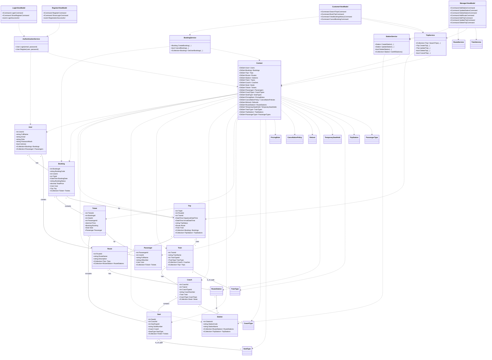
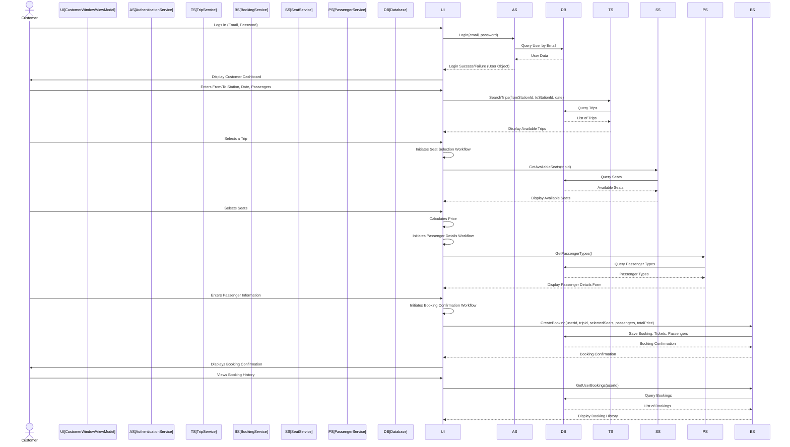
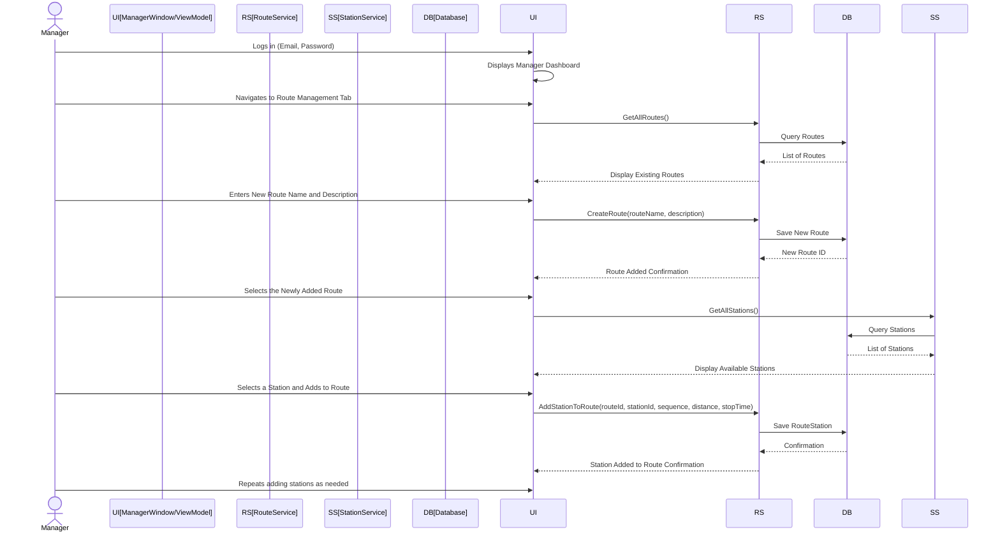
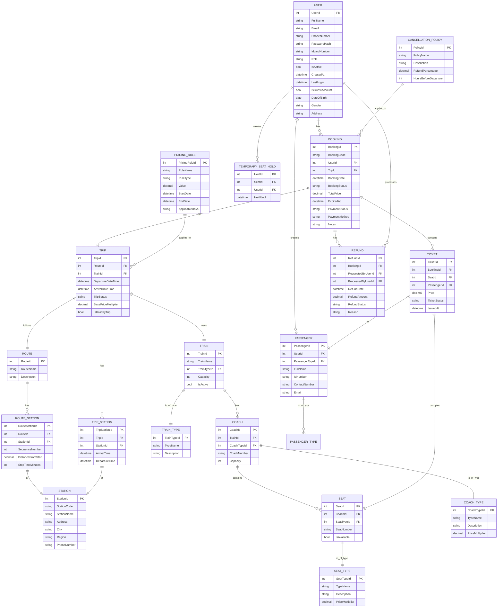

# Software Requirements Specification: Train Booking Application

## 1. System Overview

### 1.1. Purpose
This document specifies the requirements for the Train Booking Application, as reverse-engineered from the codebase. It aims to provide a comprehensive understanding of the system's functionality, architecture, and design for the engineering team responsible for its maintenance and extension.

### 1.2. Scope
The Train Booking Application is a desktop application designed to facilitate the booking and management of train tickets. Its core functionalities include user authentication (registration, login), searching for train trips, booking tickets, managing passenger details, viewing booking history, and administrative features for managing train-related data (stations, routes, trains, trips, pricing, etc.). The system's boundaries encompass the client-side application and its interaction with a backend data store.

### 1.3. Intended Audience & User Roles
This document is intended for the engineering team involved in the development, maintenance, and future enhancements of the Train Booking Application.

The identified user roles (Actors) in the system are:

*   **Customer**: An individual who uses the application to search for and book train tickets. They can register for an account, log in, manage their bookings, and view their travel history.
*   **Manager**: An administrative user responsible for configuring and managing the operational aspects of the train booking system. This includes managing train schedules, routes, stations, train details, and pricing rules.

### 1.4. Design and Implementation Constraints
*   **Technology Stack**: The system is built using C# and Windows Presentation Foundation (WPF) for the user interface.
*   **Data Persistence**: Entity Framework Core (EF Core) is used for object-relational mapping, implying a relational database backend (e.g., SQL Server, SQLite).
*   **Architectural Pattern**: The application adheres to the Model-View-ViewModel (MVVM) architectural pattern.

## 2. UML Diagrams

### 2.1. Use Case Diagram
A Use Case Diagram illustrating the interactions between user roles (Actors) and the system's main features.

```mermaid
graph TD
    actor_customer[Customer]
    actor_manager[Manager]

    subgraph System
        uc_register[Register for Account]
        uc_login[Login to System]
        uc_search_trips[Search for Train Trips]
        uc_book_ticket[Book Train Ticket]
        uc_view_bookings[View Booking History]
        uc_cancel_booking[Cancel Booking]
        uc_manage_stations[Manage Stations]
        uc_manage_routes[Manage Routes]
        uc_manage_trains[Manage Trains]
        uc_manage_trips[Manage Trips]
        uc_manage_coach_types[Manage Coach Types]
        uc_manage_seat_types[Manage Seat Types]
        uc_manage_pricing_rules[Manage Pricing Rules]
    end

    actor_customer --> uc_register
    actor_customer --> uc_login
    actor_customer --> uc_search_trips
    actor_customer --> uc_book_ticket
    actor_customer --> uc_view_bookings
    actor_customer --> uc_cancel_booking

    actor_manager --> uc_login
    actor_manager --> uc_manage_stations
    actor_manager --> uc_manage_routes
    actor_manager --> uc_manage_trains
    actor_manager --> uc_manage_trips
    actor_manager --> uc_manage_coach_types
    actor_manager --> uc_manage_seat_types
    actor_manager --> uc_manage_pricing_rules
```

### 2.2. Class Diagram
A Class Diagram showing the core architectural classes (Models, ViewModels/Services, DbContext) and their relationships.

### 2.3. Sequence Diagrams
Illustrates the sequence of interactions for critical user scenarios.

#### 2.3.1. Customer Books a Ticket

#### 2.3.2. Manager Adds a New Route

## 3. Database Design

### 3.1. Entity-Relationship Diagram (ERD)
A text-based ERD showing entities and their relationships.

### 3.2. Database Schema and Table Descriptions

#### Table: `Users`
| Column Name | Data Type | Constraints | Description |
|---|---|---|---|
| `UserId` | `int` | PK | Unique identifier for the user. |
| `FullName` | `string` | NOT NULL | Full name of the user. |
| `Email` | `string` | NOT NULL | User's email address (unique). |
| `PhoneNumber` | `string` | NOT NULL | User's phone number. |
| `PasswordHash` | `string` | NULLABLE | Hashed password for security. |
| `IdcardNumber` | `string` | NULLABLE | National ID card number of the user. |
| `Role` | `string` | NOT NULL | User's role (e.g., "Customer", "Manager"). |
| `IsActive` | `bool` | NOT NULL | Indicates if the user account is active. |
| `CreatedAt` | `datetime` | NULLABLE | Timestamp when the user account was created. |
| `LastLogin` | `datetime` | NULLABLE | Timestamp of the user's last login. |
| `IsGuestAccount` | `bool` | NOT NULL | Indicates if the user is a guest. |
| `DateOfBirth` | `date` | NULLABLE | User's date of birth. |
| `Gender` | `string` | NULLABLE | User's gender. |
| `Address` | `string` | NULLABLE | User's address. |

#### Table: `Bookings`
| Column Name | Data Type | Constraints | Description |
|---|---|---|---|
| `BookingId` | `int` | PK | Unique identifier for the booking. |
| `BookingCode` | `string` | NOT NULL | Unique code for the booking. |
| `UserId` | `int` | FK (`Users`) | Foreign key to the `Users` table. |
| `TripId` | `int` | FK (`Trips`) | Foreign key to the `Trips` table. |
| `BookingDate` | `datetime` | NOT NULL | Date and time when the booking was made. |
| `BookingStatus` | `string` | NOT NULL | Current status of the booking (e.g., "Confirmed", "Cancelled", "Pending"). |
| `TotalPrice` | `decimal` | NOT NULL | Total price of the booking. |
| `ExpiredAt` | `datetime` | NULLABLE | Timestamp when the booking hold expires. |
| `PaymentStatus` | `string` | NULLABLE | Status of the payment (e.g., "Paid", "Pending", "Refunded"). |
| `PaymentMethod` | `string` | NULLABLE | Method used for payment. |
| `Notes` | `string` | NULLABLE | Any additional notes for the booking. |

#### Table: `Trips`
| Column Name | Data Type | Constraints | Description |
|---|---|---|---|
| `TripId` | `int` | PK | Unique identifier for the trip. |
| `RouteId` | `int` | FK (`Routes`) | Foreign key to the `Routes` table. |
| `TrainId` | `int` | FK (`Trains`) | Foreign key to the `Trains` table. |
| `DepartureDateTime` | `datetime` | NOT NULL | Scheduled departure date and time. |
| `ArrivalDateTime` | `datetime` | NOT NULL | Scheduled arrival date and time. |
| `TripStatus` | `string` | NOT NULL | Current status of the trip (e.g., "Active", "Cancelled", "Completed"). |
| `BasePriceMultiplier` | `decimal` | NOT NULL | Multiplier for the base price of tickets on this trip. |
| `IsHolidayTrip` | `bool` | NOT NULL | Indicates if the trip is during a holiday period. |

#### Table: `Routes`
| Column Name | Data Type | Constraints | Description |
|---|---|---|---|
| `RouteId` | `int` | PK | Unique identifier for the route. |
| `RouteName` | `string` | NOT NULL | Name of the route. |
| `Description` | `string` | NULLABLE | Description of the route. |

#### Table: `Stations`
| Column Name | Data Type | Constraints | Description |
|---|---|---|---|
| `StationId` | `int` | PK | Unique identifier for the station. |
| `StationCode` | `string` | NOT NULL | Unique code for the station (e.g., "NYC", "LAX"). |
| `StationName` | `string` | NOT NULL | Full name of the station. |
| `Address` | `string` | NULLABLE | Physical address of the station. |
| `City` | `string` | NULLABLE | City where the station is located. |
| `Region` | `string` | NULLABLE | Region/State where the station is located. |
| `PhoneNumber` | `string` | NULLABLE | Contact phone number for the station. |

#### Table: `Trains`
| Column Name | Data Type | Constraints | Description |
|---|---|---|---|
| `TrainId` | `int` | PK | Unique identifier for the train. |
| `TrainName` | `string` | NOT NULL | Name or identifier of the train. |
| `TrainTypeId` | `int` | FK (`TrainTypes`) | Foreign key to the `TrainTypes` table. |
| `Capacity` | `int` | NOT NULL | Total passenger capacity of the train. |
| `IsActive` | `bool` | NOT NULL | Indicates if the train is currently active/in service. |

#### Table: `Coaches`
| Column Name | Data Type | Constraints | Description |
|---|---|---|---|
| `CoachId` | `int` | PK | Unique identifier for the coach. |
| `TrainId` | `int` | FK (`Trains`) | Foreign key to the `Trains` table. |
| `CoachTypeId` | `int` | FK (`CoachTypes`) | Foreign key to the `CoachTypes` table. |
| `CoachNumber` | `string` | NOT NULL | Unique number or identifier for the coach within a train. |
| `Capacity` | `int` | NOT NULL | Seating capacity of the coach. |

#### Table: `Seats`
| Column Name | Data Type | Constraints | Description |
|---|---|---|---|
| `SeatId` | `int` | PK | Unique identifier for the seat. |
| `CoachId` | `int` | FK (`Coaches`) | Foreign key to the `Coaches` table. |
| `SeatTypeId` | `int` | FK (`SeatTypes`) | Foreign key to the `SeatTypes` table. |
| `SeatNumber` | `string` | NOT NULL | Unique number or identifier for the seat within a coach. |
| `IsAvailable` | `bool` | NOT NULL | Indicates if the seat is currently available. |

#### Table: `Tickets`
| Column Name | Data Type | Constraints | Description |
|---|---|---|---|
| `TicketId` | `int` | PK | Unique identifier for the ticket. |
| `BookingId` | `int` | FK (`Bookings`) | Foreign key to the `Bookings` table. |
| `SeatId` | `int` | FK (`Seats`) | Foreign key to the `Seats` table. |
| `PassengerId` | `int` | FK (`Passengers`) | Foreign key to the `Passengers` table. |
| `Price` | `decimal` | NOT NULL | Price of this specific ticket. |
| `TicketStatus` | `string` | NOT NULL | Status of the ticket (e.g., "Confirmed", "Used", "Refunded"). |
| `IssuedAt` | `datetime` | NOT NULL | Timestamp when the ticket was issued. |

#### Table: `Passengers`
| Column Name | Data Type | Constraints | Description |
|---|---|---|---|
| `PassengerId` | `int` | PK | Unique identifier for the passenger. |
| `UserId` | `int` | FK (`Users`) | Foreign key to the `Users` table (can be null for guest passengers). |
| `PassengerTypeId` | `int` | FK (`PassengerTypes`) | Foreign key to the `PassengerTypes` table. |
| `FullName` | `string` | NOT NULL | Full name of the passenger. |
| `IdNumber` | `string` | NULLABLE | Identification number of the passenger (e.g., passport, national ID). |
| `ContactNumber` | `string` | NULLABLE | Contact phone number for the passenger. |
| `Email` | `string` | NULLABLE | Email address for the passenger. |

#### Table: `CoachTypes`
| Column Name | Data Type | Constraints | Description |
|---|---|---|---|
| `CoachTypeId` | `int` | PK | Unique identifier for the coach type. |
| `TypeName` | `string` | NOT NULL | Name of the coach type (e.g., "Economy", "Business", "First Class"). |
| `Description` | `string` | NULLABLE | Description of the coach type. |
| `PriceMultiplier` | `decimal` | NOT NULL | Multiplier applied to ticket prices for this coach type. |

#### Table: `SeatTypes`
| Column Name | Data Type | Constraints | Description |
|---|---|---|---|
| `SeatTypeId` | `int` | PK | Unique identifier for the seat type. |
| `TypeName` | `string` | NOT NULL | Name of the seat type (e.g., "Window", "Aisle", "Standard"). |
| `Description` | `string` | NULLABLE | Description of the seat type. |
| `PriceMultiplier` | `decimal` | NOT NULL | Multiplier applied to ticket prices for this seat type. |

#### Table: `TrainTypes`
| Column Name | Data Type | Constraints | Description |
|---|---|---|---|
| `TrainTypeId` | `int` | PK | Unique identifier for the train type. |
| `TypeName` | `string` | NOT NULL | Name of the train type (e.g., "High-Speed", "Commuter", "Sleeper"). |
| `Description` | `string` | NULLABLE | Description of the train type. |

#### Table: `RouteStations`
| Column Name | Data Type | Constraints | Description |
|---|---|---|---|
| `RouteStationId` | `int` | PK | Unique identifier for the route station entry. |
| `RouteId` | `int` | FK (`Routes`) | Foreign key to the `Routes` table. |
| `StationId` | `int` | FK (`Stations`) | Foreign key to the `Stations` table. |
| `SequenceNumber` | `int` | NOT NULL | Order of the station within the route. |
| `DistanceFromStart` | `decimal` | NOT NULL | Distance of this station from the start of the route. |
| `StopTimeMinutes` | `int` | NOT NULL | Planned stop time at this station in minutes. |

#### Table: `TripStations`
| Column Name | Data Type | Constraints | Description |
|---|---|---|---|
| `TripStationId` | `int` | PK | Unique identifier for the trip station entry. |
| `TripId` | `int` | FK (`Trips`) | Foreign key to the `Trips` table. |
| `StationId` | `int` | FK (`Stations`) | Foreign key to the `Stations` table. |
| `ArrivalTime` | `datetime` | NOT NULL | Actual or scheduled arrival time at this station for the specific trip. |
| `DepartureTime` | `datetime` | NOT NULL | Actual or scheduled departure time from this station for the specific trip. |

#### Table: `PricingRules`
| Column Name | Data Type | Constraints | Description |
|---|---|---|---|
| `PricingRuleId` | `int` | PK | Unique identifier for the pricing rule. |
| `RuleName` | `string` | NOT NULL | Name of the pricing rule. |
| `RuleType` | `string` | NOT NULL | Type of rule (e.g., "Discount", "Surcharge", "Holiday"). |
| `Value` | `decimal` | NOT NULL | The value of the rule (e.g., percentage, fixed amount). |
| `StartDate` | `datetime` | NULLABLE | Start date for the rule's applicability. |
| `EndDate` | `datetime` | NULLABLE | End date for the rule's applicability. |
| `ApplicableDays` | `string` | NULLABLE | Days of the week the rule applies (e.g., "Mon,Tue,Wed"). |

#### Table: `CancellationPolicies`
| Column Name | Data Type | Constraints | Description |
|---|---|---|---|
| `PolicyId` | `int` | PK | Unique identifier for the cancellation policy. |
| `PolicyName` | `string` | NOT NULL | Name of the cancellation policy. |
| `Description` | `string` | NULLABLE | Description of the policy. |
| `RefundPercentage` | `decimal` | NOT NULL | Percentage of refund based on the policy. |
| `HoursBeforeDeparture` | `int` | NOT NULL | Minimum hours before departure for this policy to apply. |

#### Table: `Refunds`
| Column Name | Data Type | Constraints | Description |
|---|---|---|---|
| `RefundId` | `int` | PK | Unique identifier for the refund. |
| `BookingId` | `int` | FK (`Bookings`) | Foreign key to the `Bookings` table. |
| `RequestedByUserId` | `int` | FK (`Users`) | Foreign key to the `Users` table (user who requested the refund). |
| `ProcessedByUserId` | `int` | FK (`Users`) | Foreign key to the `Users` table (user who processed the refund). |
| `RefundDate` | `datetime` | NOT NULL | Date when the refund was processed. |
| `RefundAmount` | `decimal` | NOT NULL | Amount refunded. |
| `RefundStatus` | `string` | NOT NULL | Status of the refund (e.g., "Pending", "Completed", "Rejected"). |
| `Reason` | `string` | NULLABLE | Reason for the refund. |

#### Table: `TemporarySeatHolds`
| Column Name | Data Type | Constraints | Description |
|---|---|---|---|
| `HoldId` | `int` | PK | Unique identifier for the temporary seat hold. |
| `SeatId` | `int` | FK (`Seats`) | Foreign key to the `Seats` table. |
| `UserId` | `int` | FK (`Users`) | Foreign key to the `Users` table. |
| `HeldUntil` | `datetime` | NOT NULL | Timestamp until which the seat is held. |

#### Table: `PassengerTypes`
| Column Name | Data Type | Constraints | Description |
|---|---|---|---|
| `PassengerTypeId` | `int` | PK | Unique identifier for the passenger type. |
| `TypeName` | `string` | NOT NULL | Name of the passenger type (e.g., "Adult", "Child", "Senior"). |
| `Description` | `string` | NULLABLE | Description of the passenger type. |
| `PriceMultiplier` | `decimal` | NOT NULL | Multiplier applied to ticket prices for this passenger type. |

## 4. User Interface (UI) Mockups

### 4.1. Mockups
This section is reserved for UI mockups. Please attach images of the key application screens below.

### 4.2. Design Rationale and User Flow
The UI is built using WPF, following the MVVM pattern. This separation of concerns allows for a clean and maintainable codebase where the UI (Views) is declarative (XAML) and data-bound to the application logic (ViewModels).

**General Layout and Navigation:**
The application appears to have distinct windows for different functionalities, such as `LoginWindow`, `RegisterWindow`, `CustomerWindow`, and `ManagerWindow`. This suggests a flow where users first authenticate, then are directed to either the customer-specific or manager-specific interface based on their role.

*   **Login/Registration Flow**: Users start at `LoginWindow.xaml`. From there, they can navigate to `RegisterWindow.xaml` if they need to create a new account.
*   **Customer Flow**: After successful login, customers are directed to `CustomerWindow.xaml`. This window likely provides functionalities for searching trips, viewing available trips, initiating the booking process (which involves `SeatSelectionWindow.xaml`, `PassengerDetailsWindow.xaml`, and `BookingConfirmationWindow.xaml`), and managing their past bookings (`BookingDetailsWindow.xaml`).
*   **Manager Flow**: Managers, upon successful login, are directed to `ManagerWindow.xaml`. This window appears to use a tabbed interface (as suggested by `MainManagerViewModel` and various `*ManagementView.xaml` files like `StationManagementView.xaml`, `RouteManagementView.xaml`, etc.) to organize different administrative tasks. This allows managers to switch between managing stations, routes, trains, trips, and other system configurations.

**Key Screen Design Rationale (Inferred):**
*   **Login/Register**: Simple forms with input fields for credentials/user details and action buttons. Error messages are likely displayed to guide the user.
*   **Customer Dashboard (`CustomerWindow`)**: Likely features search criteria input (From/To Station, Date, Passenger Count), a list of search results (available trips), and sections for viewing booking history.
*   **Booking Workflow (`SeatSelectionWindow`, `PassengerDetailsWindow`, `BookingConfirmationWindow`)**: These windows guide the user through a multi-step process.
    *   `SeatSelectionWindow`: Displays train layout and available seats, allowing users to select desired seats.
    *   `PassengerDetailsWindow`: Collects information for each passenger.
    *   `BookingConfirmationWindow`: Summarizes the booking details (trip, seats, passengers, total price) before final confirmation.
*   **Manager Dashboard (`ManagerWindow`)**: Tabbed interface, with each tab (`*ManagementView`) providing forms for adding/editing entities (e.g., station details, route information) and data grids to display existing records. This allows for efficient CRUD (Create, Read, Update, Delete) operations on system data.

## 5. CI/CD Planning

### 5.1. CI/CD Pipeline Overview
The project includes a CI/CD workflow file located at `.github/workflows/dotnet-ci.yml`. This indicates that the project uses GitHub Actions for its continuous integration and continuous deployment processes.

The pipeline is configured to run on the following triggers:
*   **`push` events**: Whenever code is pushed to the `main` branch.
*   **`pull_request` events**: Whenever a pull request is opened, synchronized, or reopened targeting the `main` branch.

This setup ensures that all code changes are automatically built and tested before being merged into the main codebase, promoting code quality and stability.

### 5.2. Integration and Deployment Process
The `.github/workflows/dotnet-ci.yml` file defines the steps for the CI/CD pipeline. Based on typical .NET CI workflows, the process likely includes:

1.  **Checkout Code**: Retrieves the latest code from the repository.
2.  **Setup .NET**: Configures the appropriate .NET SDK environment.
3.  **Restore Dependencies**: Downloads and restores all necessary NuGet packages for the solution.
4.  **Build Solution**: Compiles the entire .NET solution, ensuring there are no compilation errors.
5.  **Run Tests**: Executes all unit tests and potentially integration tests defined within the project (e.g., `TrainManagementWPF.Tests`). This step is crucial for verifying the correctness and functionality of the code changes.
6.  **Publish (Optional/Inferred)**: For deployment, there might be additional steps to publish the build artifacts, which could then be used for deployment to a staging or production environment. (This step is inferred as common in CI/CD, but specific deployment targets are not detailed in the provided file path).

## 6. System Features & Functional Requirements

### 6.1. Feature: User Authentication

#### 6.1.1. Description
This feature allows users to register for a new account, log in to the application, and manage their session.

#### 6.1.2. Functional Requirements (User Stories)
*   **REQ-AUTH-01**: As a user, I can register for a new account by providing my full name, email, phone number, password, and confirming the password.
*   **REQ-AUTH-02**: As a user, I can optionally provide my ID card number, date of birth, gender, and address during registration.
*   **REQ-AUTH-03**: As a user, I can log in to the system using my registered email and password.
*   **REQ-AUTH-04**: As a user, I should receive an error message if I attempt to register with an email that is already in use.
*   **REQ-AUTH-05**: As a user, I should receive an error message if I attempt to log in with invalid credentials.
*   **REQ-AUTH-06**: As a user, my last login timestamp should be updated upon successful login.
*   **REQ-AUTH-07**: As a user, I can navigate from the login screen to the registration screen.
*   **REQ-AUTH-08**: As a user, I can navigate from the registration screen back to the login screen.

#### 6.1.3. Business Rules
*   **RULE-AUTH-01**: [Inferred] A user's password must meet certain complexity requirements (e.g., minimum length, combination of characters). (Requires `IPasswordService` implementation details for exact rules).
*   **RULE-AUTH-02**: [Inferred] Email addresses must be unique for each registered user.
*   **RULE-AUTH-03**: [Inferred] New user accounts are assigned a default role of "Customer".
*   **RULE-AUTH-04**: [Inferred] User accounts are active upon registration.

### 6.2. Feature: Trip Search and Booking

#### 6.2.1. Description
This feature allows customers to search for available train trips based on their criteria, select a trip, choose seats, provide passenger details, and confirm their booking.

#### 6.2.2. Functional Requirements (User Stories)
*   **REQ-BOOK-01**: As a customer, I can search for train trips by specifying a departure station, arrival station, and departure date.
*   **REQ-BOOK-02**: As a customer, I can optionally specify a return date to search for round trips.
*   **REQ-BOOK-03**: As a customer, I can specify the number of passengers for the trip.
*   **REQ-BOOK-04**: As a customer, I should see a list of available trips matching my search criteria.
*   **REQ-BOOK-05**: As a customer, I should be informed if no trips are found for my search criteria.
*   **REQ-BOOK-06**: As a customer, I can select a trip from the search results to proceed with booking.
*   **REQ-BOOK-07**: As a customer, after selecting a trip, I can view the available seats for that trip.
*   **REQ-BOOK-08**: As a customer, I can select one or more seats for my booking.
*   **REQ-BOOK-09**: As a customer, I can provide details (full name, ID number, contact, email) for each passenger.
*   **REQ-BOOK-10**: As a customer, I can review the selected trip details, chosen seats, passenger information, and total price before confirming the booking.
*   **REQ-BOOK-11**: As a customer, I can confirm the booking, which should create a new booking record and associated tickets.
*   **REQ-BOOK-12**: As a customer, I should receive a confirmation message upon successful booking.
*   **REQ-BOOK-13**: As a customer, I can cancel the booking process at any stage (seat selection, passenger details, confirmation).
*   **REQ-BOOK-14**: As a customer, I can swap the 'From' and 'To' stations in the search criteria.

#### 6.2.3. Business Rules
*   **RULE-BOOK-01**: [Inferred] Departure station and arrival station must be different for a trip search.
*   **RULE-BOOK-02**: [Inferred] Departure date must be today or in the future.
*   **RULE-BOOK-03**: [Inferred] For round trips, the return date must be after the departure date.
*   **RULE-BOOK-04**: [Inferred] The number of passengers must be at least 1 and likely has an upper limit (e.g., 9).
*   **RULE-BOOK-05**: [Inferred] Seat availability is checked during the seat selection process.
*   **RULE-BOOK-06**: [Inferred] Pricing for tickets is calculated based on the trip's base price, coach type, seat type, and passenger type multipliers, and any applicable pricing rules.
*   **RULE-BOOK-07**: [Inferred] A temporary hold might be placed on selected seats during the booking workflow to prevent double-booking.

### 6.3. Feature: Booking Management (Customer)

#### 6.3.1. Description
This feature allows customers to view their past and current bookings and cancel existing bookings.

#### 6.3.2. Functional Requirements (User Stories)
*   **REQ-BM-01**: As a customer, I can view a list of all my bookings.
*   **REQ-BM-02**: As a customer, I can view detailed information for a specific booking, including trip details, passenger information, and ticket details.
*   **REQ-BM-03**: As a customer, I can cancel a confirmed booking.
*   **REQ-BM-04**: As a customer, I should receive a confirmation message upon successful booking cancellation.
*   **REQ-BM-05**: As a customer, I should be prevented from canceling a booking if it is too close to the departure time or if its status does not allow cancellation.

#### 6.3.3. Business Rules
*   **RULE-BM-01**: [Inferred] Only bookings with a "Confirmed" status can be cancelled by the customer.
*   **RULE-BM-02**: [Inferred] Bookings can only be cancelled if they are not expired (i.e., `ExpiredAt` is null or in the future).
*   **RULE-BM-03**: [Inferred] Cancellation might be subject to a cancellation policy (e.g., partial refund, no refund) based on the time remaining until departure.

### 6.4. Feature: Station Management (Manager)

#### 6.4.1. Description
This feature allows managers to add, update, delete, and search for train stations.

#### 6.4.2. Functional Requirements (User Stories)
*   **REQ-SM-01**: As a manager, I can add a new station by providing a unique station code, station name, and optionally address, city, region, and phone number.
*   **REQ-SM-02**: As a manager, I can update the details of an existing station.
*   **REQ-SM-03**: As a manager, I can delete an existing station.
*   **REQ-SM-04**: As a manager, I can search for stations by a search term (e.g., station code, name).
*   **REQ-SM-05**: As a manager, I should be prevented from adding a station with a station code that already exists.
*   **REQ-SM-06**: As a manager, I should be prevented from deleting a station if it is currently used in any routes or trips.

#### 6.4.3. Business Rules
*   **RULE-SM-01**: [Inferred] Station codes must be unique.
*   **RULE-SM-02**: [Inferred] Station names must be unique.

### 6.5. Feature: Route Management (Manager)

#### 6.5.1. Description
This feature allows managers to add, update, delete routes, and manage the stations associated with each route.

#### 6.5.2. Functional Requirements (User Stories)
*   **REQ-RM-01**: As a manager, I can add a new route by providing a route name and optionally a description.
*   **REQ-RM-02**: As a manager, I can update the name and description of an existing route.
*   **REQ-RM-03**: As a manager, I can delete an existing route.
*   **REQ-RM-04**: As a manager, I can add an existing station to a selected route, specifying its sequence number, distance from start, and stop time.
*   **REQ-RM-05**: As a manager, I can remove a station from a selected route.
*   **REQ-RM-06**: As a manager, I should be prevented from adding a route with a name that already exists.
*   **REQ-RM-07**: As a manager, I should be prevented from deleting a route if it is currently used in any trips.
*   **REQ-RM-08**: As a manager, I should be prevented from adding a station to a route if it already exists on that route.

#### 6.5.3. Business Rules
*   **RULE-RM-01**: [Inferred] Route names must be unique.
*   **RULE-RM-02**: [Inferred] Stations within a route must have a unique sequence number.
*   **RULE-RM-03**: [Inferred] When a station is removed from a route, the sequence numbers of subsequent stations on that route should be adjusted.

### 6.6. Feature: Trip Management (Manager)

#### 6.6.1. Description
This feature allows managers to add, update, delete, and cancel train trips.

#### 6.6.2. Functional Requirements (User Stories)
*   **REQ-TM-01**: As a manager, I can add a new trip by selecting a route and a train, specifying departure and arrival date/time, base price multiplier, and whether it's a holiday trip.
*   **REQ-TM-02**: As a manager, I can update the details of an existing trip.
*   **REQ-TM-03**: As a manager, I can delete an existing trip.
*   **REQ-TM-04**: As a manager, I can cancel an active trip.
*   **REQ-TM-05**: As a manager, I should be prevented from deleting a trip if it has associated bookings.
*   **REQ-TM-06**: As a manager, I should be prevented from canceling a trip if its status is not "Active".

#### 6.6.3. Business Rules
*   **RULE-TM-01**: [Inferred] Departure date/time must be before arrival date/time.
*   **RULE-TM-02**: [Inferred] A trip's status can be "Active", "Cancelled", or "Completed".
*   **RULE-TM-03**: [Inferred] Cancelling a trip should update its status to "Cancelled".

### 6.7. Feature: Train Management (Manager)

#### 6.7.1. Description
This feature allows managers to manage train details, including adding, updating, and deleting trains.

#### 6.7.2. Functional Requirements (User Stories)
*   **REQ-TRM-01**: As a manager, I can add a new train by providing a train name, selecting a train type, and specifying its capacity.
*   **REQ-TRM-02**: As a manager, I can update the details of an existing train.
*   **REQ-TRM-03**: As a manager, I can delete an existing train.
*   **REQ-TRM-04**: As a manager, I should be prevented from deleting a train if it is currently assigned to any active trips.

#### 6.7.3. Business Rules
*   **RULE-TRM-01**: [Inferred] Train names must be unique.
*   **RULE-TRM-02**: [Inferred] Train capacity must be a positive integer.

### 6.8. Feature: Coach Type Management (Manager)

#### 6.8.1. Description
This feature allows managers to define and manage different types of coaches (e.g., Economy, Business).

#### 6.8.2. Functional Requirements (User Stories)
*   **REQ-CTM-01**: As a manager, I can add a new coach type by providing a type name, description, and price multiplier.
*   **REQ-CTM-02**: As a manager, I can update the details of an existing coach type.
*   **REQ-CTM-03**: As a manager, I can delete an existing coach type.
*   **REQ-CTM-04**: As a manager, I should be prevented from deleting a coach type if it is currently assigned to any coaches.

#### 6.8.3. Business Rules
*   **RULE-CTM-01**: [Inferred] Coach type names must be unique.
*   **RULE-CTM-02**: [Inferred] Price multiplier must be a positive decimal.

### 6.9. Feature: Seat Type Management (Manager)

#### 6.9.1. Description
This feature allows managers to define and manage different types of seats (e.g., Window, Aisle).

#### 6.9.2. Functional Requirements (User Stories)
*   **REQ-STM-01**: As a manager, I can add a new seat type by providing a type name, description, and price multiplier.
*   **REQ-STM-02**: As a manager, I can update the details of an existing seat type.
*   **REQ-STM-03**: As a manager, I can delete an existing seat type.
*   **REQ-STM-04**: As a manager, I should be prevented from deleting a seat type if it is currently assigned to any seats.

#### 6.9.3. Business Rules
*   **RULE-STM-01**: [Inferred] Seat type names must be unique.
*   **RULE-STM-02**: [Inferred] Price multiplier must be a positive decimal.

### 6.10. Feature: Pricing Rule Management (Manager)

#### 6.10.1. Description
This feature allows managers to define and manage pricing rules that affect ticket prices (e.g., discounts, surcharges).

#### 6.10.2. Functional Requirements (User Stories)
*   **REQ-PRM-01**: As a manager, I can add a new pricing rule by providing a rule name, type (e.g., "Discount", "Surcharge"), value, start date, end date, and applicable days.
*   **REQ-PRM-02**: As a manager, I can update the details of an existing pricing rule.
*   **REQ-PRM-03**: As a manager, I can delete an existing pricing rule.

#### 6.10.3. Business Rules
*   **RULE-PRM-01**: [Inferred] Pricing rule names must be unique.
*   **RULE-PRM-02**: [Inferred] Start date must be before or equal to the end date.
*   **RULE-PRM-03**: [Inferred] Applicable days should be a valid comma-separated list of days (e.g., "Mon,Wed,Fri").

## 7. Non-Functional Requirements (NFRs)

### 7.1. Performance
*   **NFR-PERF-01**: [Inferred] The system should handle a reasonable number of concurrent users (e.g., 50-100) for typical train booking operations without significant degradation in response time.
*   **NFR-PERF-02**: [Inferred] Key operations such as searching for trips and confirming bookings should complete within an acceptable timeframe (e.g., under 3-5 seconds) under normal load.
*   **NFR-PERF-03**: [Inferred] Data loading in manager views should be efficient, especially for large datasets of stations, routes, or trips.

### 7.2. Security
*   **NFR-SEC-01**: [Inferred] User passwords must be securely hashed and salted before storage in the database.
*   **NFR-SEC-02**: [Inferred] The application must be protected against common web vulnerabilities, such as SQL Injection (given EF Core usage, this is largely handled by the framework but still a consideration for raw queries if any).
*   **NFR-SEC-03**: [Inferred] Sensitive user data (e.g., ID card numbers) should be handled and stored securely.
*   **NFR-SEC-04**: [Inferred] Role-based access control (RBAC) must be enforced, ensuring that managers can only access administrative functionalities and customers can only access customer-specific functionalities.
*   **NFR-SEC-05**: [Inferred] All communication involving sensitive data (e.g., login credentials, booking details) should be encrypted (e.g., via HTTPS if there's a web component, or secure channels for desktop app).

### 7.3. Reliability
*   **NFR-REL-01**: [Inferred] The system should have high availability, aiming for an uptime of at least 99.5%.
*   **NFR-REL-02**: [Inferred] Database connections must be managed properly to prevent resource exhaustion and ensure data consistency.
*   **NFR-REL-03**: [Inferred] The application should gracefully handle unexpected errors and provide informative messages to the user without crashing.
*   **NFR-REL-04**: [Inferred] Data integrity must be maintained, especially for critical operations like booking and cancellation.